

> documentation generated using version 0.0.1

`artyfarty` focuses on providing easy access to a few 'nice' ggplot
theme, it also includes a number of predefined palettes and watermark
convenience functions.

`artyfarty` is a **work in progress**. For now you can install the
development version using `devtools`.

    devtools::install_github('bart6114/artyfarty')

Available themes
================

farty
-----

    ggplot(diamonds) +
      geom_bar(aes(cut, fill=cut)) +
      theme_farty() +
      ggtitle("Sparkly stones") +
      scale_fill_manual(values = pal("flat"))

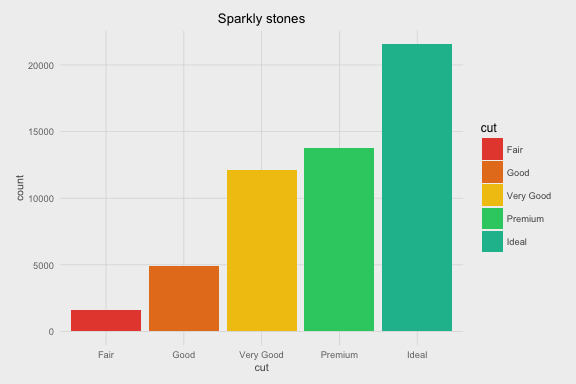

    ggplot(mtcars) +
      geom_point(aes(x=wt, y=qsec, color=as.factor(cyl))) +
      theme_farty() +
      ggtitle("Vroom") +
      scale_color_manual(values = pal("flat"))

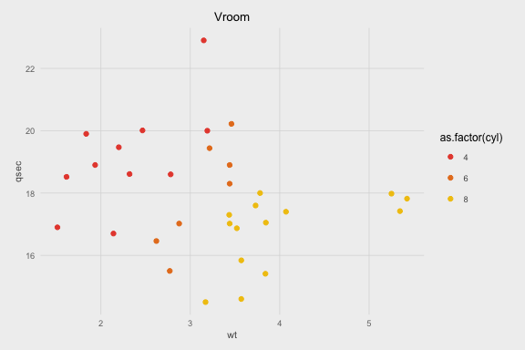

scientific
----------

    ggplot(diamonds) +
      geom_bar(aes(cut, fill=cut)) +
      theme_scientific() +
      ggtitle("Sparkly stones") +
      scale_fill_manual(values = pal("five38"))

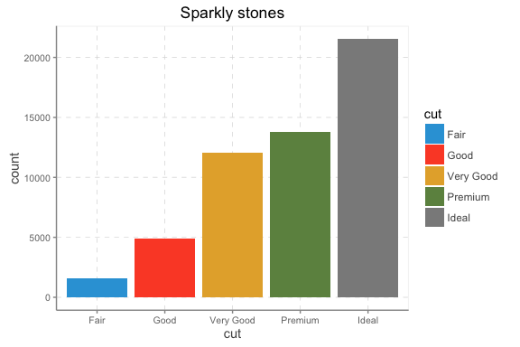

    ggplot(mtcars) +
      geom_point(aes(x=wt, y=qsec, color=as.factor(cyl))) +
      theme_scientific() +
      ggtitle("Vroom") +
      scale_color_manual(values = pal("five38"))

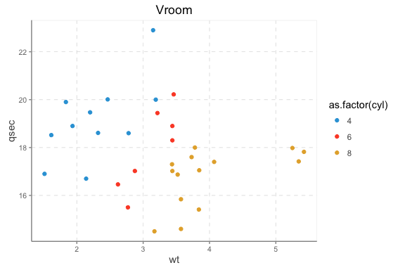

monokai
-------

    ggplot(diamonds) +
      geom_bar(aes(cut, fill=cut)) +
      theme_monokai() +
      ggtitle("Sparkly stones") +
      scale_fill_manual(values = pal("monokai"))

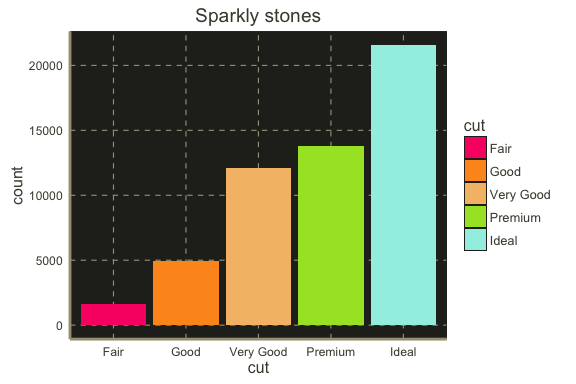

    ggplot(mtcars) +
      geom_point(aes(x=wt, y=qsec, color=as.factor(cyl))) +
      theme_monokai() +
      ggtitle("Vroom") +
      scale_color_manual(values = pal("monokai"))

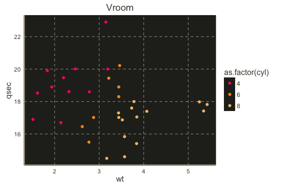

monokai\_full
-------------

    ggplot(diamonds) +
      geom_bar(aes(cut, fill=cut)) +
      theme_monokai_full() +
      ggtitle("Sparkly stones") +
      scale_fill_manual(values = pal("monokai"))

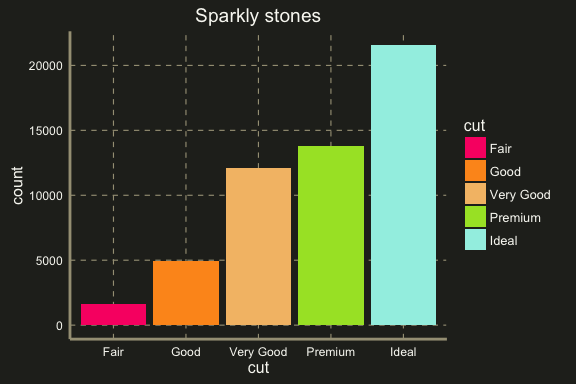

    ggplot(mtcars) +
      geom_point(aes(x=wt, y=qsec, color=as.factor(cyl))) +
      theme_monokai_full() +
      ggtitle("Vroom") +
      scale_color_manual(values = pal("monokai"))

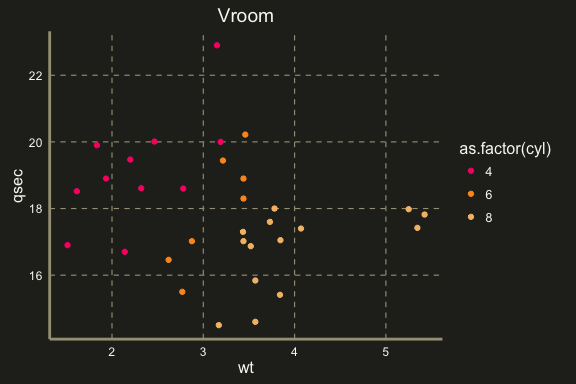

flat
----

    ggplot(diamonds) +
      geom_bar(aes(cut, fill=cut)) +
      theme_flat() +
      ggtitle("Sparkly stones") +
      scale_fill_manual(values = pal("flat"))

    ggplot(mtcars) +
      geom_point(aes(x=wt, y=qsec, color=as.factor(cyl))) +
      theme_flat() +
      ggtitle("Vroom") +
      scale_color_manual(values = pal("flat"))

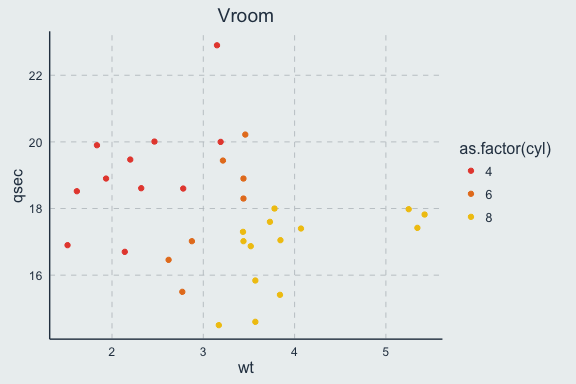

five38
------

    ggplot(diamonds) +
      geom_bar(aes(cut, fill=cut)) +
      theme_five38() +
      ggtitle("Sparkly stones") +
      scale_fill_manual(values = pal("five38"))

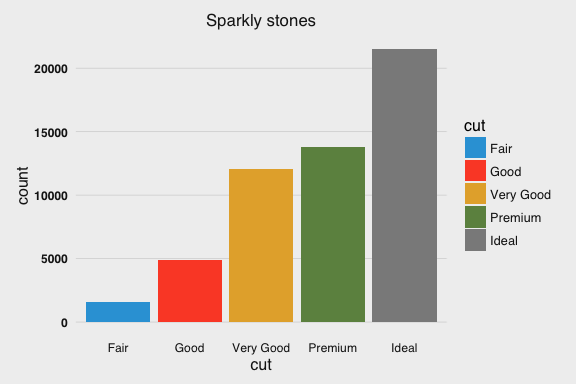

    ggplot(diamonds) +
      geom_bar(aes(cut, fill=cut)) +
      theme_five38(grid_lines = "horizontal") +
      ggtitle("Sparkly stones") +
      scale_fill_manual(values = pal("five38")) +
      coord_flip()

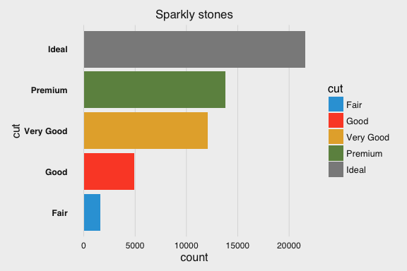

    ggplot(mtcars) +
      geom_point(aes(x=wt, y=qsec, color=as.factor(cyl))) +
      theme_five38() +
      ggtitle("Vroom") +
      scale_color_manual(values = pal("five38"))

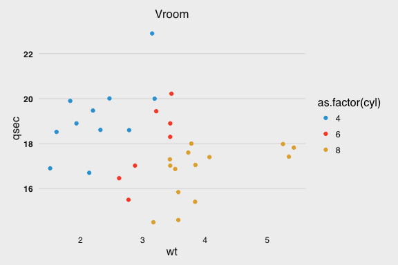

retro
-----

    ggplot(diamonds) +
      geom_bar(aes(cut, fill=cut)) +
      theme_retro() +
      ggtitle("Sparkly stones") +
      scale_fill_manual(values = pal("retro"))

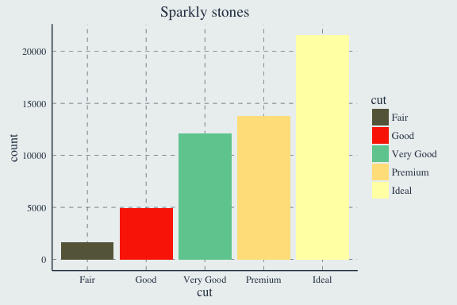

    ggplot(mtcars) +
      geom_point(aes(x=wt, y=qsec, color=as.factor(cyl))) +
      theme_retro() +
      ggtitle("Vroom") +
      scale_color_manual(values = pal("retro"))

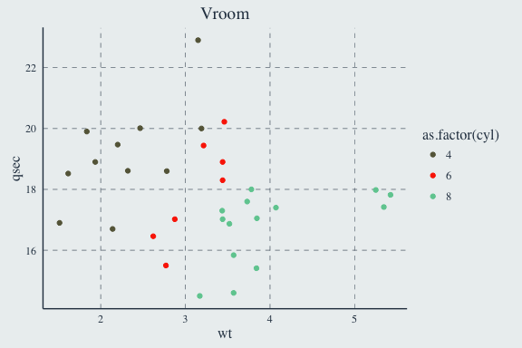

ft
--

    ggplot(diamonds) +
      geom_bar(aes(cut, fill=cut)) +
      theme_ft() +
      ggtitle("Sparkly stones") +
      scale_fill_manual(values = pal("ft"))

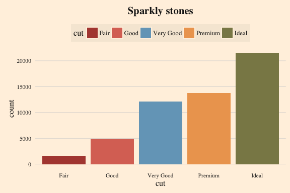

    ggplot(diamonds) +
      geom_bar(aes(cut, fill=cut)) +
      theme_ft(grid_lines = "horizontal") +
      ggtitle("Sparkly stones") +
      scale_fill_manual(values = pal("ft")) +
      coord_flip()

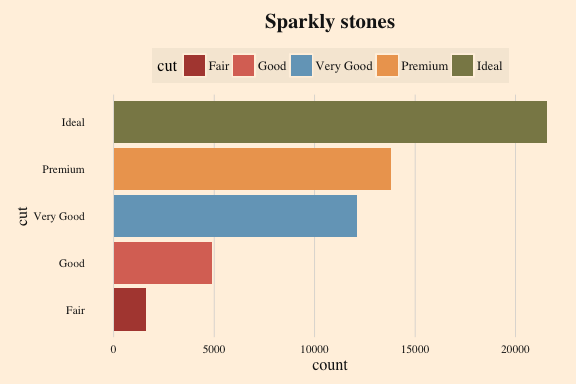

    ggplot(mtcars) +
      geom_point(aes(x=wt, y=qsec, color=as.factor(cyl))) +
      theme_ft() +
      ggtitle("Vroom") +
      scale_color_manual(values = pal("ft"))

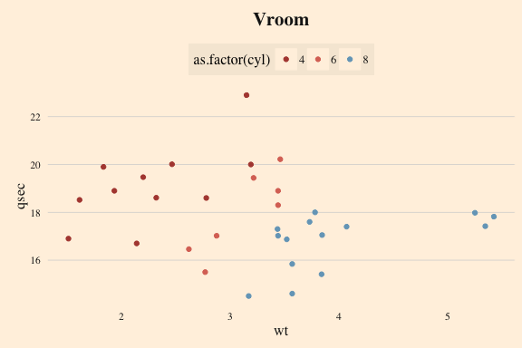

bain
----

    ggplot(diamonds) +
      geom_bar(aes(cut, fill=cut)) +
      theme_bain() +
      ggtitle("Sparkly stones") +
      scale_fill_manual(values = pal("bain"))

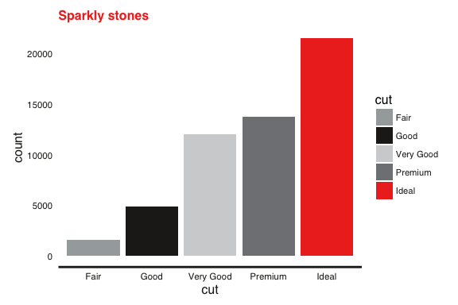

    ggplot(diamonds) +
      geom_bar(aes(cut, fill=cut)) +
      theme_bain(grid_lines = "horizontal") +
      ggtitle("Sparkly stones") +
      scale_fill_manual(values = pal("bain")) +
      coord_flip()

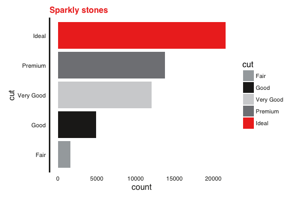

    ggplot(mtcars) +
      geom_point(aes(x=wt, y=qsec, color=as.factor(cyl))) +
      theme_bain() +
      ggtitle("Vroom") +
      scale_color_manual(values = pal("bain"))

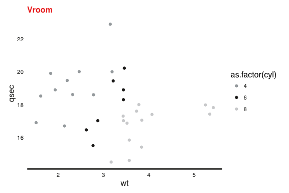

economist
---------

    ggplot(diamonds) +
      geom_bar(aes(cut, fill=cut)) +
      theme_economist() +
      ggtitle("Sparkly stones") +
      scale_fill_manual(values = pal("economist"))

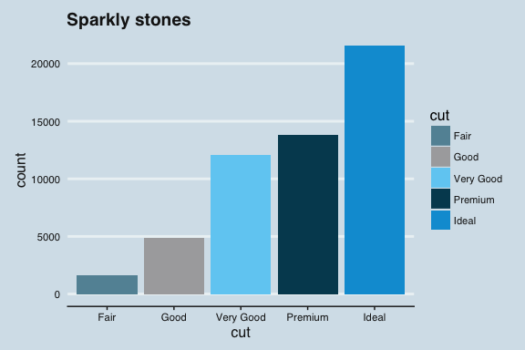

    ggplot(diamonds) +
      geom_bar(aes(cut, fill=cut)) +
      theme_economist(grid_lines = "horizontal") +
      ggtitle("Sparkly stones") +
      scale_fill_manual(values = pal("economist")) +
      coord_flip()

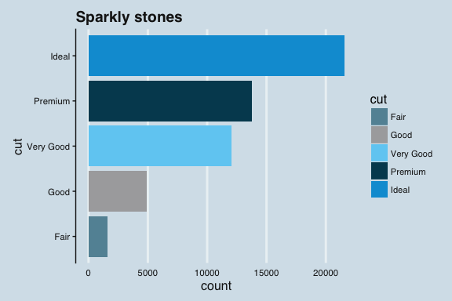

    ggplot(mtcars) +
      geom_point(aes(x=wt, y=qsec, color=as.factor(cyl))) +
      theme_economist() +
      ggtitle("Vroom") +
      scale_color_manual(values = pal("economist"))

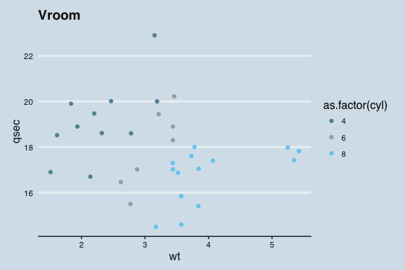

empty
-----

    ggplot(diamonds) +
      geom_bar(aes(cut, fill=cut)) +
      theme_empty() +
      ggtitle("Sparkly stones") +
      scale_fill_manual(values = pal("flat"))

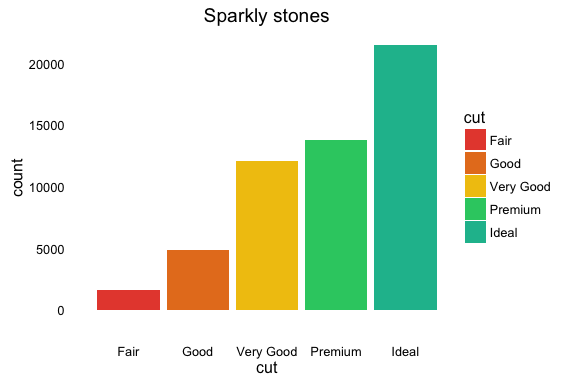

    ggplot(mtcars) +
      geom_point(aes(x=wt, y=qsec, color=as.factor(cyl))) +
      theme_empty() +
      ggtitle("Vroom") +
      scale_color_manual(values = pal("flat"))

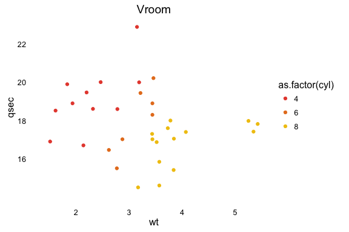

Palettes
========

A number of palettes are available through the `pal()` function. A
visual overview can be acquired as follows:

    plot_palettes()

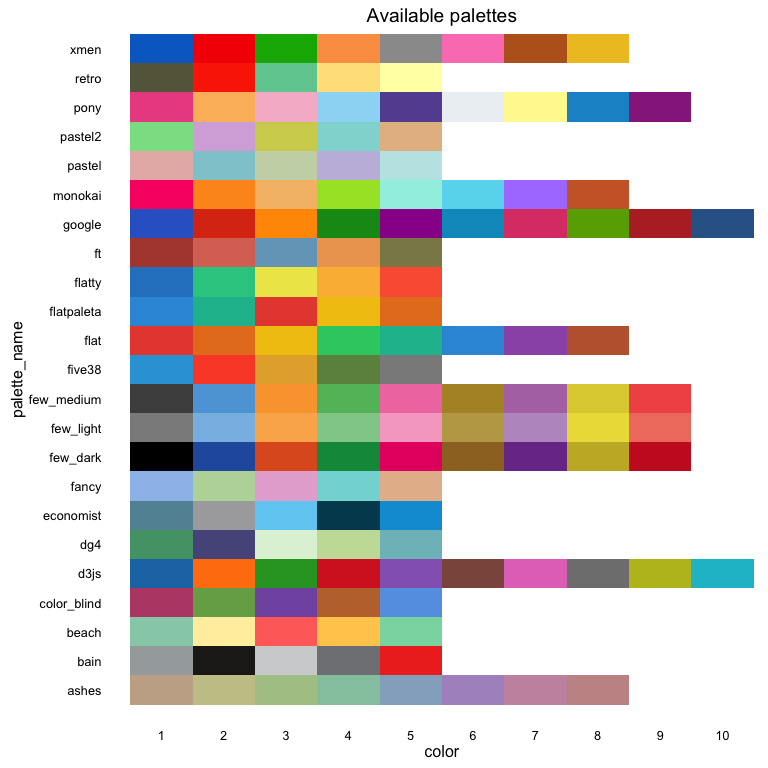

Check the `?pal()` documentation for more specifications.

Watermarks
==========

A watermark might not add much value to a plot, but there are times that
you just need to be able to to add a simple watermark.

    ggplot(diamonds) +
      geom_bar(aes(cut, fill=cut)) +
      theme_retro() +
      ggtitle("Sparkly stones") +
      scale_fill_manual(values = pal("retro")) +
      watermark_img("vignettes/Rlogo.png", alpha=.4, location="tl")

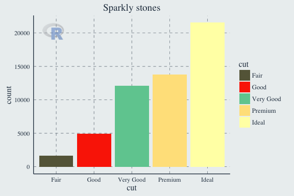

    ggplot(mtcars) +
      geom_point(aes(x=wt, y=qsec, color=as.factor(cyl))) +
      theme_ft() +
      ggtitle("Vroom") +
      scale_color_manual(values = pal("ft")) +
      watermark_txt("watermark", location="br")

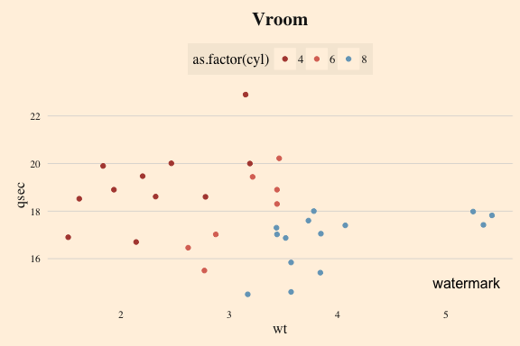
